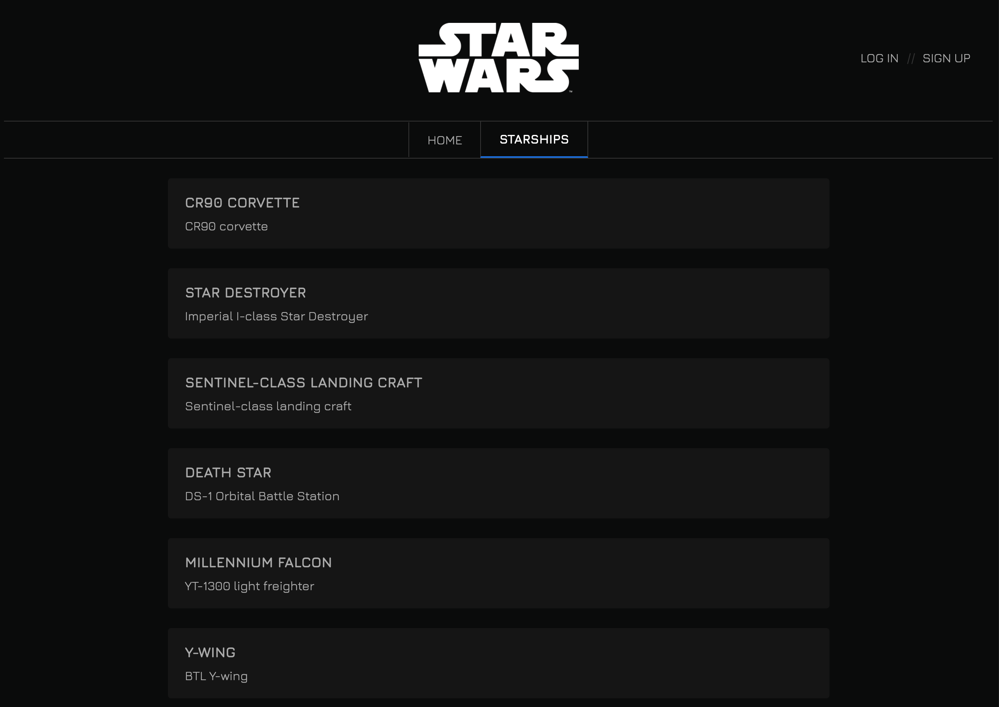

# SPRINT 8. VUE AVENÇAT

###### Sumari

- Descripció i Objectius

- Part teòrica
  
  - Curs Vue, part 3
  
  - Curs Vue, part 4
  
  - A practicar

- Part pràctica. S8. Star Wars

---

# DESCRIPCIÓ I OBJECTIUS

És hora de començar a testar la teva aplicació!

És un tema difícil, però és important que puguis assolir els conceptes teòrics d'aquest sprint, ja que, pot preparar-te per saber com actuar davant d'una entrevista laboral!

##### **Objectiu general**

- Aprendre a crear els teus primers tests.

- Saber utilitzar Vuex, centralitzant tota la lògica i dades de l'aplicació.

##### **Objectius específics**

- Saber utilitzar Test Utils, la llibreria oficial de testing de Vue.  

- Fer servir Jest per córrer test en Vue.

- Saber crear un store de Vuex. 

- Crear accions i mutacions de Vuex.

- Implementar getters perquè els components puguin obtenir les dades del state de Vuex.

---

# PART TEÒRICA

## Curs Vue, part 3

En aquest curs aprendràs els conceptes fonamentals d'unit **testing** en Vue.

Les proves unitàries o **unit testing** són una manera de comprovar que un fragment de codi funciona correctament.

És un dels procediments que s'utilitzen per dur a terme dins d'una metodologia àgil de treball, per tant, és totalment necessari perquè, tanmateix, garanteixi la qualitat del codi.

### Vue Test Útils

Abans de començar, està bé que tinguis clar els principals elements del testing:

- **Vue Test Útils** és la llibreria de testing oficial per a Vue.js. Ens dona molta facilitat a l'hora de muntar components, simular esdeveniments d'usuari, renderitzat superficial, modificar l'estat i els props de components i més.

- **Jest** és el motor de tests mantingut (s'utilitza per Facebook). Els avantatges principals de Jest sobre altres frameworks de tests són: per un cantó, la velocitat i, per l'altre, que no és necessari configurar res (o gairebé res) per fer-lo servir. Per tant, permet més adaptabilitat i potencia les funcions.

- **TDD o Test-driven development** és un procés de desenvolupament de programari que segueix un cicle molt curt:

-Es defineixen els requisits del programari.

-Es creen tests per a cobrir aquests requeriments.

-S'implementa el programari per a passar els tests.

A continuació, pots conèixer les diferents modalitats sobre com es realitza un test unitari al teu codi:

[Vue Testing with Vue Test Utils - YouTube](https://www.youtube.com/watch?v=QIDhzBg5eWY)

### Testejar un component amb Jest

A continuació, tens un exemple molt simple sobre com testar a fons el comportament d'un component:

**->[Vue js unit test a Vue component with jest](https://egghead.io/lessons/vue-js-unit-test-a-vue-component-with-jest)**  

### Jest

Convé aprofundir respecte al funcionament de **Jest,** que es caracteritza per actuar amb molta "naturalitat" a l'hora de crear tests.

Visualitza amb detall el següent vídeo  que explica com fer un **Unit test** utilitzant **Jest.**

[Unit Test con Jest - YouTube](https://www.youtube.com/watch?v=mJnAtmTAP-U)

## Curs Vue, part 4 (Vuex)

En aquesta part del curs s'expliquen els conceptes avançats de **Vue** i **Vuex**.

És molt important que sàpigues llegir documentacions de les tecnologies que utilitzes. Per això, després d'aprendre un concepte nou en cada apartat d'aquest curs, et recomanem acudir a la documentació oficial de Vue i repassar aquest concepte.

**->[Documentació oficial de Vue](https://v3.vuejs.org/guide/introduction.html#what-is-vue-js)**

A més la documentació oficial de Vue està molt ben estructurada, amb explicacions molt clares i concises!

Aquí tens també l'enllaç a la documentació de Vuex.

**->[Documentació de Vuex](https://vuex.vuejs.org/#what-is-a-state-management-pattern).**

---

### Introducció a Vuex

Quan treballes amb una llibreria com Vue, la informació dels components es transporta de component pare a component fill a través de "props" i viceversa a través d'emetre un esdeveniment que escoltarà el pare. 

Hi ha algunes vegades que necessites accedir a informació d'un component des d'un altre sense que tinguin la relació de pare i fill. Com l'obtindràs llavors? Tècnicament, es pot fer, però a més de ser complicat acabes amb la lògica de negoci repartida per qualsevol component que segurament es repeteix i que en aplicacions grans és un autèntic caos. 

Aquí és on entra la centralització d'aquesta informació amb eines com Vuex (en Vue) o Redux (en React). No sols pots centralitzar informació, sinó també funcions!

A continuació, tens les instruccions per instal·lar-ho i els primers passos en Vuex:

[#10 Introducción a Vuex (Instalación con CDN) | Curso de Vue.js 😍 Desde Cero - YouTube](https://www.youtube.com/watch?v=-qmLWz6pWnM)

>  **Important**
> 
> Guarda l'exemple d'aquest primer vídeo, ja que continuarem amb ell en els següents apartats d'aquesta part del curs.

Atès que Vuex costa entendre al principi, i el vídeo anterior és massa superficial, et proposem un altre segon vídeo en el qual s'explica més en profunditat Vuex:

[VUEX - Introducción COMPLETA al MANEJO DE ESTADOS con Vue.js - YouTube](https://www.youtube.com/watch?v=zJkPhjjOZ0A)

### State i mapState de Vuex

Ara aprendrem com compartir l'estat de l'store de Vuex de manera elegant "mapeando" el state amb mapSatate.

[#11 mapState con Vuex | Curso de Vue.js 😍 Desde Cero - YouTube](https://www.youtube.com/watch?v=KyLjsiQradM)

### Mutation i mapMutation en Vuex

Amb Vuex no podem arribar a una variable de l'estat des d'un component i manipular-la perquè canviï directament. Ja que, executant aquesta tasca, els components no reaccionarien al canvi i no tindria cap utilitat.

Pel fet que la llibreria segueix un sistema de flux unidireccional, on totes les fases es trobin en un cicle tancat, haurem d'utilitzar un nou concepte conegut com a "mutacions". Les mutacions són aquelles funcions que s'encarreguen de canviar el valor del nostre estat.

[#12 mapMutation y Parámetros en Mutation con Vuex | Curso de Vue.js 😍 Desde Cero - YouTube](https://www.youtube.com/watch?v=eQ_fVRbYIbM)

>  **Important**
> 
> No s'han de gestionar operacions asíncrones des de les mutacions.

**Com gestionem l'asincronia en les meves aplicacions? No podré fer anomenades a servidor o bases de dades en una aplicació de Vue?** Doncs sí, per això van néixer les accions, que veurem en el següent capítol.

### Action y mapAction en Vuex

Les accions funcionen igual que les mutacions. Això sí, no poden mutar l'estat – això ho deleguen a les mutacions – i es permeten totes les operacions asíncrones que necessitem. Per exemple, una crida a API:

[#13 Action y mapAction con Vuex | Curso de Vue.js 😍 Desde Cero - YouTube](https://www.youtube.com/watch?v=qPPxLX0yHfM)

### Getters de Vuex

**Els "Getters" són part de la store Vuex** i s'utilitzen per calcular dades basades ​​en l'estat de l'store.

Bàsicament, són una de les moltes coses que fan que Vue i Vuex siguin excepcionalment potents quan actuen juntes.

> “*Vuex ens permet definir 'getters' en el store. Pot pensar en ells com a 'computed properties' per als ssotres.*”.

 Documentació oficial de Vue

Algunes coses que són genials sobre els getters és que:

- Són fàcilment accessibles dins dels components i les actions de Vuex.

- Emmagatzemen dades en caché i s'actualitzen de manera intel·ligent quan canvia l'estat.

- Poden retornar funcions, de manera que sigui possible passar arguments addicionals per a calcular dades basades ​​en ells.

[GETTERS | VueJS &amp; Vuex | Learning the Basics - YouTube](https://www.youtube.com/watch?v=iw1eajzWQAM)

### Moduls de Vuex

Tal com passa amb la nostra aplicació, quan un **Store** comença a créixer massa pot presentar més dificultats per poder gestionar-ho en un únic fitxer. Com **Vuex** presenta una solució on es gestiona tot l'estat en únic objecte, hem de pensar una forma per a poder **"modularitzar"**, però alhora continuar tenint aquesta estructura en arbre únic.

**Vuex** compta amb una funcionalitat que ens permetrà dividir el nostre arbre de dades en mòduls més específics, els quals comptaran cadascun d'ells amb tot el necessari per gestionar aquestes porcions.

D'aquesta manera segmentarem la nostra aplicació de tal manera que les dades no es barregin.

[VUEX Modules | Aprende a trabajar con módulos en Vue.js [ESPAÑOL] - YouTube](https://www.youtube.com/watch?v=Nzne3qYMl_o)

### Nuxt

**Nuxt.js** és un framework que està basat en Vue.js i escrit en JavaScript.

És totalment modular, de manera que podem començar amb un paquet molt senzill i, segons els nostres requeriments i el nostre projecte vagi creixent, podem instal·lar les llibreries o paquets que necessitem.

**Nuxt.js** ve a solucionar una mica les configuracions, que eren més tedioses, amb Vue.js, ja que fa que aquest procés sigui realment fàcil i molt senzill.

[Nuxt.js - Introduction by Project - YouTube](https://www.youtube.com/watch?v=nteDXuqBfn0)

### Navigation Guards

Imagina que tens un sistema web on qualsevol usuari pot registrar-se i "loguearse". Tenint en compte que la majoria dels sistemes, posseeixen una zona de panell d'administració, a la qual, només els usuaris Administradors poden entrar.

Com programaries això? Fàcil, depenent de quin usuari estigui "loguejat", em fixo que rol o permís té i ho habilito a ingressar al panell o no, això sense importar el framework o llenguatge s'ha de complir.

Ara bé, imagineu-vos en el cas que hagin de bloquejar l'accés a 20 vistes. No es torna molt tediós haver de fer el codi en cadascuna d'elles per a revisar si té permisos o no? Bé, en el cas de **Vue**, aquí es podrien utilitzar els guards (a més de moltes altres funcions que posseeixen):

[Getting Started with Vue.js Navigation Guards to Restrict Access to Routes - YouTube](https://www.youtube.com/watch?v=30XtkPC8nHI)

## A practicar!

Com sempre diem, la millor manera d'acabar d'entendre els conceptes apresos és practicant!

A continuació, tens un tutorial molt complet, en el qual es fa el **setup** del projecte, es creen els components i es maqueten, s'implementen les rutes, l'autenticació, crea les vistes d'administrador amb la seva gestió de rols i molt més.

Veuràs que és una mica llarg, però almenys les 3 primeres hores hauries de poder anar ràpidament, ja que, has estat diverses setmanes amb Vue!

Aquest tutorial et pot servir per a fer protfoli, a més d'aprendre Firebase, servei en el núvol que ens ajuda a crear aplicacions sense haver de saber **Back - end**.

Moltes empreses valoren que sàpigues tecnologies en el núvol com Firebase, Amazon Web Services, Azure...

[6 Hour Vue.js &amp; Firebase Project - FireBlogs - YouTube](https://www.youtube.com/watch?v=ISv22NNL-aE)

**Nota**: Si no tens temps a acabar-ho, pots continuar-ho quan acabis el curs.

---

# PART PRÀCTICA S8. STAR WARS

### Objectius

- Repassar els components, props, serveis i routing.

- Consumir dades d'una API.

- Utilitzar localStorage.

- Practicar Vuex.

- Protegir rutes.

## Descripció

En aquest exercici les dades a consumir ja no estan **hardcodeadas** en l'aplicació, sinó que seran consumides per un servidor. 

**Aquest lliurament està basat en una prova tècnica** d'una gran empresa del sector **e-commerce**, que busca desenvolupadors/es front-end en la ciutat de Barcelona. Per tant, és molt comú utilitzar-lo com una prova tècnica: consum de dades d'API, mostrar-les en una pantalla a través d'un llistat i implementar detalladament cada ítem del llistat.

**La web que has de desenvolupar ha de mostrar informació sobre les naus de Star Wars!** S**'**haurà de mostrar el llistat de naus amb la informació detallada de cada una d'elles. 

#### Informació d'API per consumir

Per sort, no haurem d'implementar una API per guardar les dades en una base de dades i poder consumir-les per mitjà d'una sèrie de crides. En aquest cas, **emprarem una API que ens permetrà obtenir el llistat de naus fàcilment.**

(En qualsevol projecte professional, consumiràs dades d'una API. Per aquest motiu, és molt important entendre i saber com dur a terme els diferents mètodes per fer crides API i l'asincronisme de JavaScript.)

>  **Per saber més**
> 
> Et facilitem diferents enllaços de gran utilitat per implementar-les correctament en la teva web:
> 
> - La **documentació** **d'API** per consumir és la següent:
> 
> **->https://swapi.dev/documentation**
> 
> - **Eina per provar les crides API** (un detall per part de swapi.dev):
> 
> **->[https://swapi.dev/](https://swapi.dev/)**

>  **Important**
> 
> **A vegades les swapi.dev no funcionen** (en alguns casos les API gratuïtes poden no estar disponibles). Com a solució alternativa, podeu utilitzar:  
> 
> **->[https://swapi.py4e.com/](https://swapi.py4e.com/)**

#### Endpoints útils

Les crides **API** que t'interessen són les següents:

- Obtenció del **llistat de naus**:

**->https://swapi.dev/api/starships/**

**Important**: com s'ha esmentat anteriorment, si no funciona utilitzeu el següent enllaç:  

**->https://swapi.py4e.com/api/starships**

 - Obtenció del llistat de naus amb **paginació (*)**:

**->https://swapi.dev/api/starships/?page=1**

Modificant el número de pàgina aniràs assolint més naus.

- Pots fer servir **l'API** "starwars-visualguide.com" per a **carregar les imatges de les naus**. Un exemple de nau és:

**->https://starwars-visualguide.com/assets/img/starships/5.jpg**

Veuràs que els ids de "swapi.dev" i "starwars-visualguide.com" coincideixen.

**(*)** És **important entendre el concepte de paginació**, ja que és habitual que les API funcionin d'aquesta manera. 

Generalment, és necessari evitar la sobrecàrrega d'una consulta executada en l'API, pel fet que, pot causar un **timeout** en la sol·licitud executada. 

En general, en tots aquells serveis que retornen grans quantitats de dades és imprescindible emprar freqüentment la paginació, per així, permetre el retorn dels registres. D'aquesta manera evitem la saturació d'informació, creant un sistema de funcionament fluid i eficaç.

Com hauràs observat, si no indiquem el nombre de pàgines, el servidor no ens retornarà totes les naus, sinó que només retornarà 10. És a dir, hi ha un límit de devolució de nombre d'ítems per crides API.

Moltes API pots indicar-les en la pàgina desitjada i la quantitat d'ítems per pàgina que vols carregar. Recorda que sempre hi ha un límit superior d'ítems a carregar en una crida (en aquest cas swapi.dev està limitat a 10).

Si vols mostrar només les 10 primeres naus a l'usuari/ària, genial, no serà necessari afegir el paràmetre "**page"** a les teves crides. Malgrat això, si necessites implementar un botó amb la següent funció: "carregar més naus" o **scroll** infinit, en el qual, segons vagis baixant van apareixent més ítems, hauràs de fer ús del paràmetre "**page"**.

<u> </u>

#### Notes

Les següents indicacions són del responsable del programador/a de front-end:  

- Crearem la base del projecte sobre la qual treballar per mitjà de Vuex.

- **Est****à prohibit copiar el codi**, ja que d'aquesta manera no s'aprèn res. A més,  el segon lliurament de l'sprint 9 és una prova de nivell amb el mentor/a, en la qual hauràs de demostrar en directe que has adquirit els conceptes de Vue. 

D'altra banda,  si has fet tots els lliuraments de les tasques amb les correccions pertinents, no has de tenir problemes per aprovar la prova. Ànims!

## Nivell 1

### 

### - Exercici 1

Per a començar, el primer que has d'implementar és la **pantalla principal on es visualitzi tot el llistat de naus**.

Un cop implementat en el servidor, veuràs que aquest et retorna moltes dades interessants de cada nau, però en la pantalla principal només ensenyarem les dades més importants, per evitar una saturació de la informació.

Dades necessàries de cada producte (nau) en el llistat:

- Nom de la nau.

- Model

  

**Nota**: No et preocupis de moment pels estils, els implementaràs en l'exercici 4. És preferible centrar-se primer a desenvolupar els components i la lògica per després aplicar-li estils.  

### - Exercici 2

En aquest exercici has de crear la **fitxa de cada nau**, mostrant tots els seus detalls.

L'usuari/ària podrà accedir als detalls de cada nau clicant en cadascuna d'elles a través del llistat.

  

No et preocupis, de moment pel camp "films" i "pilots" de cada nau, més endavant mostrarem en la fitxa de cada nau els seus pilots i pel·lícules en les quals apareixen. Com pots veure, aquesta API malgrat ser gratuïta, és molt completa, ja que, ens permet fer una web informativa de Star Wars molt interessant!

Igual que existeix aquesta API de Star Wars, existeixen moltes d'altres temàtiques, imagina la quantitat de webs variades que pots fer per millorar el teu portfoli!

### - Exercici 3

GENIAL!, ja tens una versió bàsica de la web creada, en la qual l'usuari/ària pot visualitzar el llistat de naus i, si s'escau, observar la fitxa fent "clic".

No obstant això, com hauràs pogut veure, encara tenim un límit de 10 naus per mostrar. Si t'hi fixes en la resposta de la crida API, veuràs indicat un total de 36 naus, les quals mostrarem a l'usuari/ària sota demanda.

Has d'implementar un **botó al final del llistat de naus**, amb el text "view more", que permeti **obtenir més naus** del servidor i s'agreguin al llistat de naus mostrades a l'usuari/ària.

>  **Important**
> 
> **Les crides d'API s'han de fer accions de Vuex, no des dels components.**

Implementar un observable, subscrivint el component per mitjà de l'observable creat en el servei.  

**Bonus:** és preferible implementar un **scroll infinit**, que carregui més naus a mesura que l'usuari/ària faci scroll de la web.  

**Ajuda:** hauràs de fer ús de la paginació, recorre a la descripció del projecte si tens dubtes, ja que hi ha una breu descripció de la paginació i l'URL que s'ha d'implementar.

### - Exercici 4

**Modernització del site**. Canvia els estils que creguis pertinents. L'únic criteri és que s'assembli al màxim possible a la web oficial de Star Wars.  

### - Exercici 5

Igual que hem fet en els lliuraments anteriors, implementarem una **pàgina inicial de benvinguda**, i mitjançant un botó, es podrà accedir a la pàgina principal de naus. Per això, **has d'usar el routing** de Vue.

A més del botó d'accés en la pàgina principal, l'usuari/ària tindrà accés a la pàgina principal mitjançant la barra de navegació superior.

En el cas de no haver implementat encara el component, hauràs de crear la barra de navegació superior en un component separat.

### - Exercici 6

Ja gairebé has acabat la base del projecte! L'única cosa que et falta és la gestió d'usuaris/àries.

Has d'implementar una **pantalla de login i registre**, en les quals mitjançant **localstorage**, ja que no posseïm un servidor d'autenticació d'usuaris/es, es puguin registrar i logar posteriorment en cas que existeixin.

En aquest exercici, si aconsegueixes mostrar el resultat del **login/registre** per consola, serà suficient.

No t'oblidis maquetar aquestes pantalles noves de **login/registre** conforme els estils de la pàgina oficial de Star Wars.

## Nivell 2

### 

### 

### - Exercici 7

Modificarem lleugerament la navegació, perquè quan no es detecti l'usuari/ària registrat/da, se li porti al "login".

**El llistat de naus només pot ser visible per a usuaris/es registrats/des,** has de protegir les rutes.  

### - Exercici 8

En aquest exercici potenciarem l**a fitxa de cada nau** **mostrant les targetes dels seus pilots**.

**RECORDA** que amb Vue utilitzem components, per tant, hauràs de crear un nou component per mostrar aquestes targetes dins del detall de nau i no se t'oblidi **maquetar** aquesta part nova!

### - Exercici 9

Centralitzar totes les dades de l'aplicació en un **store de Vuex.**  

Carregar les dades en el component usant els **getters**.  

L'store per descomptat haurà de contenir una **acció** que s'encarregui de carregar les dades de l'API, cridant a una **mutació** per a modificar l'estat de Vuex.

## Nivell 3

### - Exercici 10

Per últim, per obtenir més informació relacionada, mostra el llistat d'actors/actrius, el detall de cada actor/actriu amb les pel·lícules en les quals apareix i les naus que sap pilotar.

---

## Criteris de qualificació

Rubrica exercici M2. Classes & Arrow Functions 

Exercici 1 (N.1). Mostra un llistat de naus, amb nom i model.

|                           |                                                                       |                                                            |
| ------------------------- | --------------------------------------------------------------------- | ---------------------------------------------------------- |
| No funciona  0punts | Funciona sense ser implementada com l'enunciat indica  0.4punts | Funciona amb la implementació sol·licitada  0.8punts |

Exercici 2 (N.1). Mostra una fitxa de cada nau.

|                           |                                                                       |                                                            |
| ------------------------- | --------------------------------------------------------------------- | ---------------------------------------------------------- |
| No funciona  0punts | Funciona sense ser implementada com l'enunciat indica  0.4punts | Funciona amb la implementació sol·licitada  0.8punts |

Exercici 3 (N.1). Implementació de paginació de naus o scroll infinit.

|                           |                                                                       |                                                            |
| ------------------------- | --------------------------------------------------------------------- | ---------------------------------------------------------- |
| No funciona  0punts | Funciona sense ser implementada com l'enunciat indica  0.4punts | Funciona amb la implementació sol·licitada  0.8punts |

Exercici 4 (N.1). Estils similars als de la web oficial de Star Wars.

|                           |                                                                       |                                                            |
| ------------------------- | --------------------------------------------------------------------- | ---------------------------------------------------------- |
| No funciona  0punts | Funciona sense ser implementada com l'enunciat indica  0.4punts | Funciona amb la implementació sol·licitada  0.8punts |

Exercici 5 (N.1). Routing amb pàgina de benvinguda.

|                           |                                                                       |                                                            |
| ------------------------- | --------------------------------------------------------------------- | ---------------------------------------------------------- |
| No funciona  0punts | Funciona sense ser implementada com l'enunciat indica  0.4punts | Funciona amb la implementació sol·licitada  0.8punts |

Exercici 6 (N.1). Login i registre amb traces en la consola.

|                           |                                                                       |                                                          |
| ------------------------- | --------------------------------------------------------------------- | -------------------------------------------------------- |
| No funciona  0punts | Funciona sense ser implementada com l'enunciat indica  0.5punts | Funciona amb la implementació sol·licitada  1punts |

Exercici 7 (N.2). Quan un usuari no estigui registrat, el redirigirem al login.

|                           |                                                                       |                                                             |
| ------------------------- | --------------------------------------------------------------------- | ----------------------------------------------------------- |
| No funciona  0punts | Funciona sense ser implementada com l'enunciat indica  0.6punts | Funciona amb la implementació sol·licitada  1.25punts |

Exercici 8 (N.2). Afegirem a la fitxa de cada nau les targetes dels seus pilots.

|                           |                                                                       |                                                             |
| ------------------------- | --------------------------------------------------------------------- | ----------------------------------------------------------- |
| No funciona  0punts | Funciona sense ser implementada com l'enunciat indica  0.6punts | Funciona amb la implementació sol·licitada  1.25punts |

Exercici 9 (N.2). Totes les dades estan centralitzades al store de Vuex. S'utilitzan els getters i mutacions per a modificar l'estat de Vuex.

|                           |                                                                       |                                                             |
| ------------------------- | --------------------------------------------------------------------- | ----------------------------------------------------------- |
| No funciona  0punts | Funciona sense ser implementada com l'enunciat indica  0.6punts | Funciona amb la implementació sol·licitada  1.25punts |

Exercici 10 (N.3). Hauràs de mostrar el llistat d'actors, el detall de cada actor amb les pel·lícules en les quals apareix i les naus que sap pilotar.

|                           |                                                                       |                                                             |
| ------------------------- | --------------------------------------------------------------------- | ----------------------------------------------------------- |
| No funciona  0punts | Funciona sense ser implementada com l'enunciat indica  0.6punts | Funciona amb la implementació sol·licitada  1.25punts |
